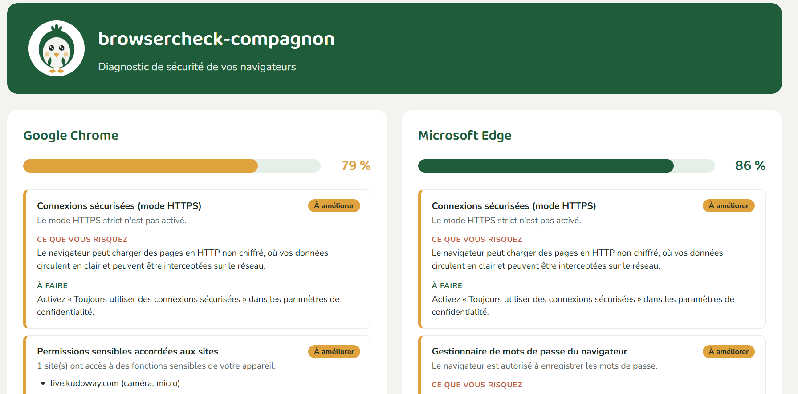

# browsercheck-compagnon

Outil PowerShell de diagnostic et de durcissement de la sécurité des navigateurs web sous Windows. Membre de la famille **« Outils Compagnon »**.

Lance un diagnostic en sept points sur Google Chrome et Microsoft Edge, produit un rapport HTML lisible, puis propose à l'utilisateur de corriger automatiquement les réglages signalés — un par un, avec son accord explicite à chaque étape.



## Ce que l'outil vérifie

| Contrôle | Diagnostic | Correction (v2.0) |
|---|---|---|
| Navigation sécurisée (Safe Browsing / SmartScreen) | ✓ | ✓ |
| Gestionnaire de mots de passe | ✓ | ✓ |
| Connexions sécurisées (mode HTTPS) | ✓ | ✓ |
| Moteur de recherche par défaut | ✓ | conseil |
| Extensions installées | ✓ | conseil |
| Permissions sensibles aux sites (caméra, micro, localisation) | ✓ | conseil |
| Mise à jour du navigateur | ✓ | conseil |

Les corrections automatiques sont appliquées via les stratégies de groupe Windows officielles (`HKLM:\SOFTWARE\Policies\…`) — le mécanisme prévu par Google et Microsoft, durable et documenté.

## Utilisation

### Pré-requis

- Windows 10 ou 11
- PowerShell 5.1 ou supérieur (préinstallé)

### Lancer

Téléchargez `browsercheck.ps1` et `rapport.css` dans un même dossier, puis :

```powershell
.\browsercheck.ps1
```

L'outil détecte automatiquement s'il dispose des droits administrateur. Si ce n'est pas le cas, il se relance lui-même en version élevée — une fenêtre UAC apparaît, vous n'avez rien à faire de plus.

> Si Windows bloque le script (« scripts désactivés sur ce système »), c'est la stratégie d'exécution PowerShell. Lancez à la place :
>
> ```powershell
> powershell -ExecutionPolicy Bypass -File .\browsercheck.ps1
> ```

### Déroulé

1. **Diagnostic** : examen des navigateurs installés, affichage dans la console.
2. **Rapport** : un rapport HTML s'ouvre dans votre navigateur, listant les points à renforcer avec des sections déroulables « Ce que vous risquez » et « À faire ».
3. **Décision** : de retour dans la fenêtre PowerShell, l'outil demande « Souhaitez-vous lancer la sécurisation ? (O/N) ».
4. **Corrections** : pour chaque point corrigeable, l'outil affiche le constat et le risque, puis attend votre confirmation. Rien n'est modifié sans « O ».
5. **Récapitulatif** : la liste des corrections appliquées, avec pour chacune la commande exacte pour l'annuler.
6. **Rapport final** : un second rapport s'ouvre, avec les contrôles corrigés marqués « ✓ Corrigé » et le score mis à jour.

Les stratégies prennent effet au prochain démarrage du navigateur. Les réglages corrigés y afficheront « géré par votre organisation » — c'est normal, c'est le signe que le durcissement tient.

## Réversibilité

Chaque correction est une simple écriture dans le registre Windows. Pour annuler une correction, le récapitulatif de l'outil affiche la commande à utiliser. Par exemple :

```powershell
Remove-ItemProperty -Path 'HKLM:\SOFTWARE\Policies\Google\Chrome' -Name 'HttpsOnlyMode'
```

Pour tout annuler en bloc :

```powershell
Remove-Item -Path 'HKLM:\SOFTWARE\Policies\Google\Chrome' -Force
Remove-Item -Path 'HKLM:\SOFTWARE\Policies\Microsoft\Edge' -Force
```

## Compatibilité

- **Systèmes** : Windows 10, Windows 11
- **Navigateurs** : Google Chrome, Microsoft Edge

## Contenu du dépôt

- `browsercheck.ps1` — le script
- `rapport.css` — la feuille de style (polices Baloo 2 et Nunito + mascotte intégrées en base64, le rapport fonctionne hors ligne)
- `LICENSE` — licence MIT

Le fichier `rapport.html` est généré localement à chaque exécution et n'est pas versionné.

## Licence

MIT — voir [LICENSE](LICENSE).

## Auteur

**Yeni DOUKAKAS** — cybercompagnon@gmail.com

Famille **Outils Compagnon** : des outils de cybersécurité pour le grand public, en français.